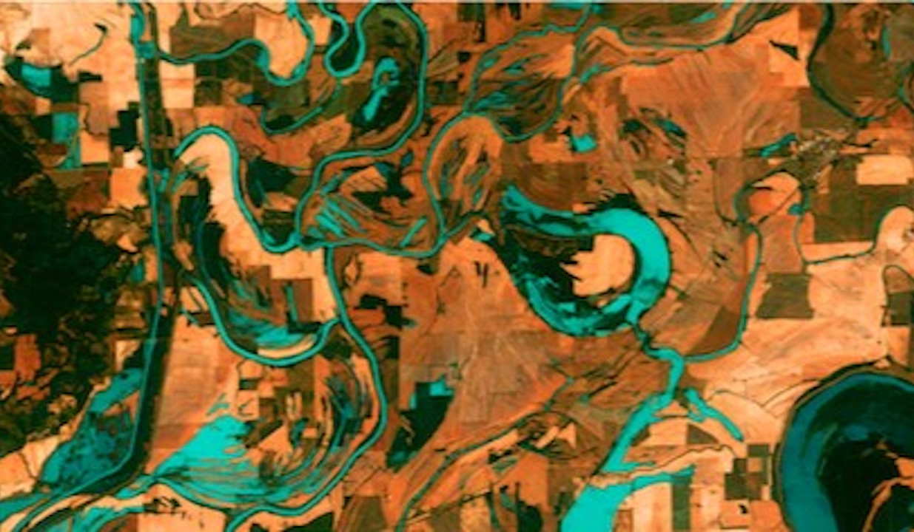
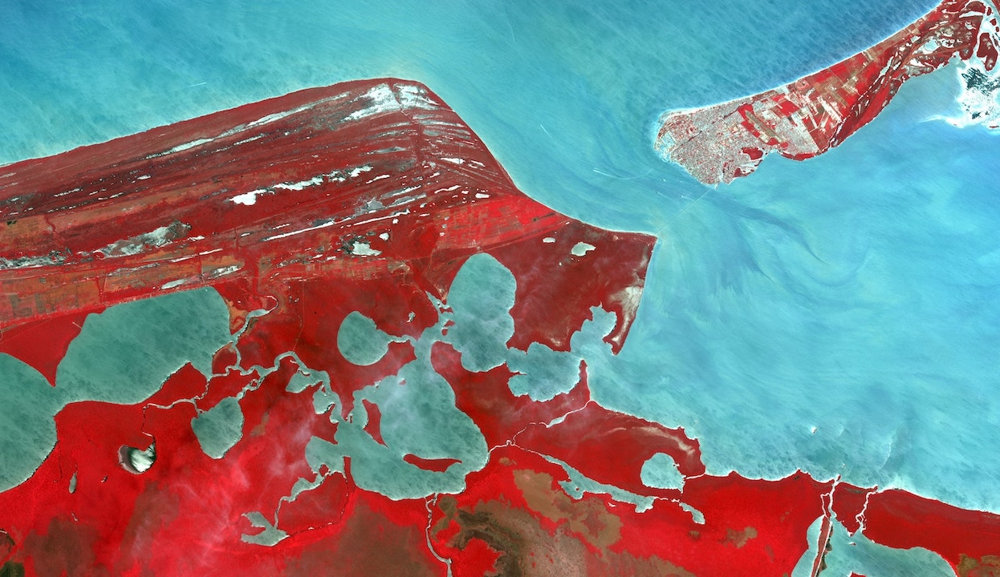
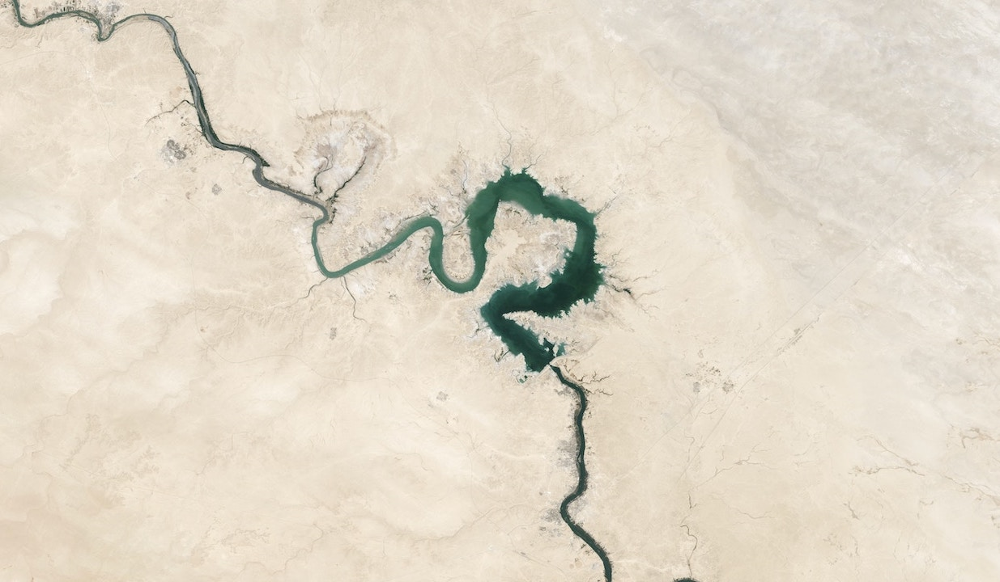

<!-- Banner -->
<section id="banner" class='ocean'>

<h2>Vacancies</h2>

A small overview of open vacancies

</section>

<!-- Wrapper -->
<section id="wrapper">

<!-- One -->								
<section id="one" class="wrapper alt style1">

<h2 class="major">Open vacancies</h2>
<section class="features">
<!-- <article>

<h3 class="major">30 month post-doc on deepfaking ecosystem response to climate extremes</h3>

We are seeking a highly motivated and skilled postdoctoral researcher to join our interdisciplinary team for the DeepV project with the Division of Forest, Nature & Landscape within the KU Leuven. This project aims to develop innovative techniques using conditional Generative Adversarial Networks (cGANs) to model and forecast ecosystem response to climate extremes based on satellite data and environmental factors. The successful candidate will play a key role in expanding the use of cGANs and integrating time series information and biophysical constraints into the modeling framework.

<ul class="actions">
<li>
<a href="./vacancies/deepv.html" class="special" target='_blank'>Learn more</a>
</li>
</ul>
</article> -->
<article>

<h3 class="major">FWO post-doc fellowships</h3>

We at KULeuven are always willing to support talented post-docs who are interested in applying to the FWO post-doc fellowship program (deadline beginning of December). If you want to develop your own 3-year postdoc project within or in close collaboration with our research team, please get in contact and we can discuss options and topics.

<ul class="actions">
<li>
<a href="https://www.fwo.be/en/fellowships-funding/postdoctoral-fellowships/" class="special" target='_blank'>Learn more at FWO</a>
</li>
</ul>
</article>
<article>

<h3 class="major">FWO PhD fellowships</h3>

If you are interested in doing a PhD in our team and considering applying for the FWO PhD fellowship program, we would be happy to support you. Please get in contact with us and we can discuss options, topics, deadlines.

<ul class="actions">
<li>
<a href="https://www.fwo.be/en/fellowships-funding/phd-fellowships/" class="special" target='_blank'>Learn more at FWO</a>
</li>
</ul>
</article>
</section>
<!-- <h2 class="major">Finished projects</h2>

Will be added soon
 -->

</section>

</section>
